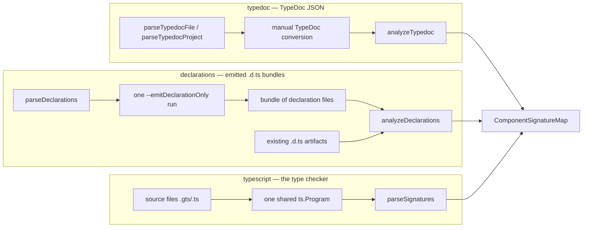

# Architecture

Turns Ember component source files into structured component docs (args,
blocks, element, style) — through three independent concepts.

## Overview

All three concepts produce the same output shape: a
`ComponentSignatureMap` keyed by file path (relative to the tsconfig
directory) and export name (`Default` sentinel for default exports).

## Public API

| Concept | Function | Input | Notes |
| ------- | -------- | ----- | ----- |
| typedoc | `parseTypedocFile(file, opts)` | one source file | TypeDoc JSON |
| typedoc | `parseTypedocProject(opts)` | tsconfig/typedoc entry points | TypeDoc JSON |
| typedoc | `analyzeTypedoc(json, opts)` | TypeDoc JSON | JSON → signatures |
| declarations | `parseDeclarations(files, opts)` | source files | one `--emitDeclarationOnly` run → `.d.ts` bundle |
| declarations | `analyzeDeclarations(bundles)` | `.d.ts` text map | pure AST parsing, no compiler |
| typescript | `parseSignatures(files, opts)` | source files | executes the type checker |

## The three concepts

### 1. typedoc

Runs TypeDoc over source files (with the virtual `.gts.ts` translation)
and extracts signatures from the serialized JSON. `analyzeTypedoc`
follows in-project interface references and interprets the common
utility wrappers; it also recovers members of types living outside the
JSON by re-reading sources when a tsconfig base is available. Works with
**any** TypeDoc JSON — including outputs where signature interfaces were
stripped (see `tests/fixtures/hokulea.json`).

### 2. declarations

Runs TypeScript **once** to emit declaration files, then parses the
bundle with oxc-parser only. The emitter keeps alias references verbatim,
so `analyzeDeclarations` resolves named references across files itself
(intersections, indexed access, `Omit`/`Pick`, transparent wrappers,
homomorphic mapped aliases). JSDoc survives declaration emit, so docs are
preserved. `analyzeDeclarations` alone works on any pre-existing `.d.ts`
artifacts — zero compiler involvement at extraction time.

Limitations vs the checker path: conditional types, template-literal
types and non-homomorphic mapped types are not executed (they surface as
raw type strings).

### 3. typescript

Builds one real `ts.Program` and resolves every signature member through
the type checker (`Signature['Args']` etc.). Executes mapped types,
conditionals, template literals and any handcrafted generic natively.
This is the most capable path and the one used by the Storybook addon.

## Shared infrastructure

- `config.ts` — the **tsconfig anchor**: both halves agree on where files
  live via the tsconfig directory (TypeDoc displayBasePath, output path
  keys, filesystem recovery).
- `ember-host.ts` — `createDocgenHost`: an Ember-aware compiler host
  (virtual `.gts.ts` names + `.gts`/`.gjs` module resolution), used by all
  three concepts whenever a program is built.
- `typedoc/ast.ts` — internal oxc helpers for the typedoc path
  (`WithBoundArgs`/`Omit` modifier recovery, external type member
  extraction). Not part of the public API.
- `signature.ts` — shared signature types, `Default` sentinel and
  `DocgenOptions`.
