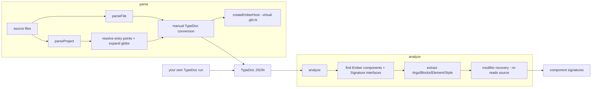

# Architecture

Turns Ember component source files into structured component docs (args,
blocks, element, style).

## Overview

The package is split into two stages so `analyze()` works on *any* TypeDoc JSON:

| Thing | Where | What it does |
| ----- | ----- | ------------ |
| `parseFile` / `parseProject` | `parse.ts` | Run TypeDoc, return JSON |
| `analyze` | `signature-extractor.ts` | JSON → component signatures |
| `resolveTsconfigBase/File` | `config.ts` | Find the tsconfig anchor |
| `extractBlockParamModifiers` | `parser.ts` | AST re-parse for `WithBoundArgs`/`Omit`/`Pick` |
| `DocgenOptions`, types, helpers | `types.ts` | Shared options, signature types, `getBlockParams`, `Default` |

## The tsconfig anchor

The one filesystem-dependent step (`modifier recovery`) must re-read source
files. Both halves agree on where files live via the tsconfig directory:

- `parse*` pins TypeDoc's `displayBasePath` to the tsconfig dir, so JSON paths
  are relative to it.
- `analyze` re-derives the tsconfig dir from the same opts and resolves paths.

Without a base (`analyze(json)` no opts), modifier recovery is skipped;
everything else still works.
